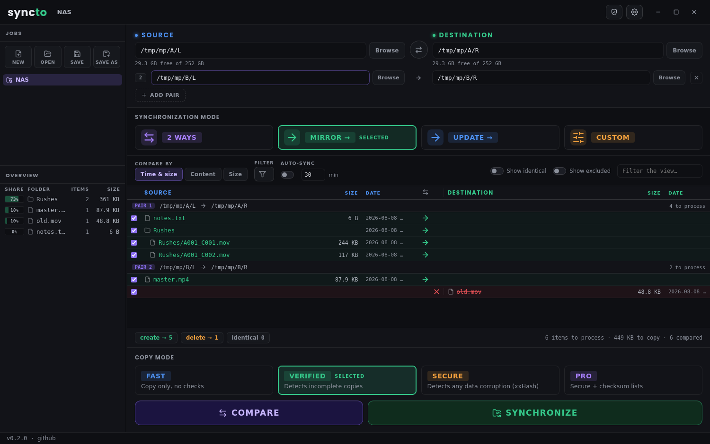
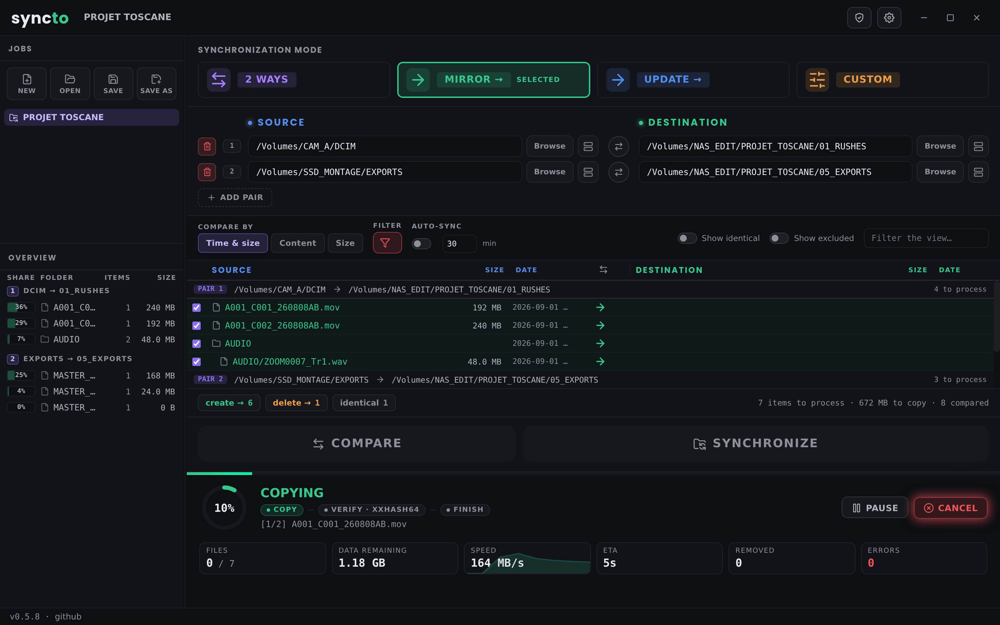
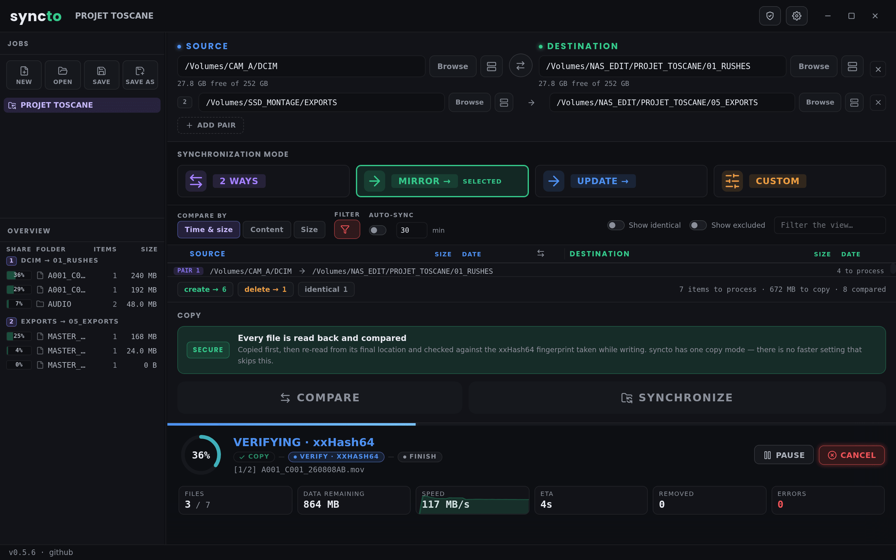
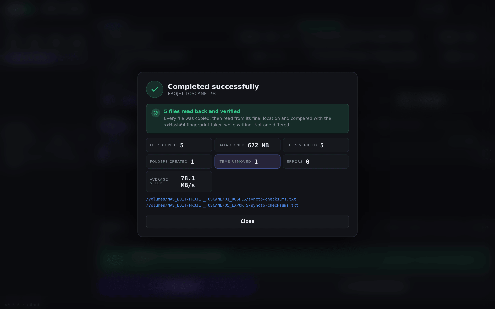
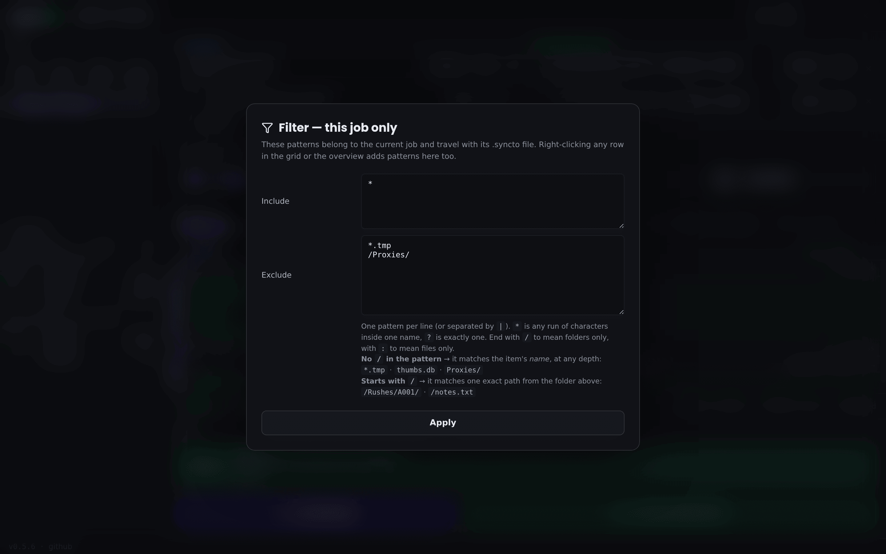
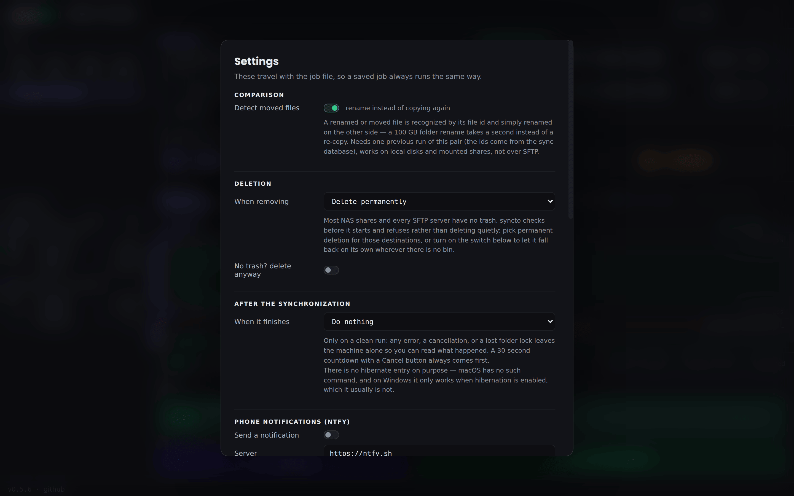
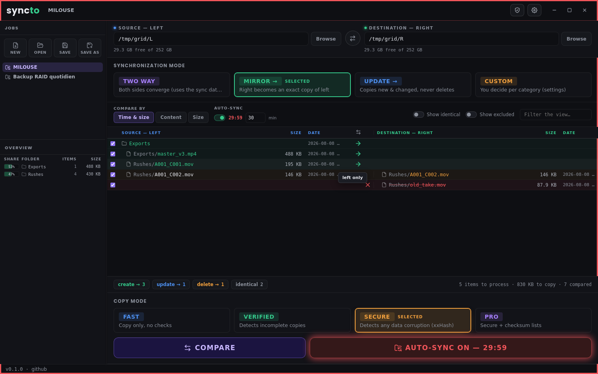
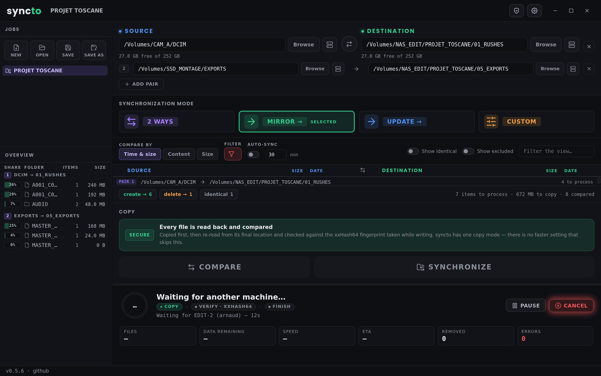

# syncto
### Folder comparison and synchronization — by Just Edit

Open-source folder sync for video and audio professionals. Same feature set as
FreeFileSync, rebuilt from scratch with the ingesto interface: progress ring,
live throughput graph, ETA, checksum-verified copy levels and an exportable
copy report.

Licensed under the **GNU General Public License v3.0** (see [`LICENSE`](./LICENSE)).

---

## Screenshots

| Main window | Copying — Secure |
|---|---|
|  |  |

| Verification pass | Run summary |
|---|---|
|  |  |

| Filter — per job | Settings |
|---|---|
|  |  |

| Auto-sync confirmation | Another machine is running |
|---|---|
|  |  |

---

## What it does

| | |
|---|---|
| **Compare** | by modification time and size, byte for byte, or by size only |
| **Synchronize** | 2 Ways, Mirror, Update, or a Custom rule per category |
| **Multi-pair** | one job synchronizes any number of folder pairs, FreeFileSync-style |
| **Moved files** | a rename is detected and replayed as a rename — no re-copy |
| **Verified copy** | three levels, up to xxHash64 read-back with a checksum sidecar |
| **Deletion** | trash or permanent — always announced, never silent |
| **Filter** | per-job include/exclude patterns, name- or path-anchored |
| **Report** | HTML, CSV and JSON, with every checksum |
| **Locking** | one machine at a time per folder, safe over any network share |
| **Remote** | local disks, mounted network shares, and SFTP |

---

## Quick install (no coding knowledge required)

### Step 1 — Install Node.js
Go to **https://nodejs.org**, click the green **LTS** button, run the installer.

### Step 2 — Download syncto
`git clone https://github.com/noar-justedit/syncto.git`
(or **Code → Download ZIP** and unzip it wherever you like).

### Step 3 — Build the app
1. Open the `syncto/scripts/` folder
2. **Double-click `build-mac.command`**
   - If macOS asks for confirmation, click **"Open"**
   - A Terminal window opens and builds everything automatically
   - The first run takes 2–3 minutes (downloading dependencies)
3. When it's done, the script offers to open the `dist/` folder

For Windows, **double-click `scripts/build-win-from-mac.command`** — it
cross-builds from your Mac.

Double-click only ever works on a `.command` file: macOS opens a `.sh` in a text
editor. And if a launcher ever answers **"you do not have appropriate access
privileges"**, the folder travelled somewhere that drops file permissions (a
FAT/exFAT stick, a sync from Windows, some unzip tools). Open Terminal in the
`syncto` folder and run `chmod +x build.sh scripts/*.sh scripts/*.command`
once — the launchers repair themselves after that.

**Building the Windows version from a Mac works.** syncto has no compiled
native module — hash-wasm is pure WebAssembly and ssh2 is pure JavaScript — so
there is nothing to cross-compile. The portable `.zip` needs nothing extra; the
`.exe` installer is assembled by Wine, so install it once with
`brew install --cask wine-stable` if you want it.

Both builds are unsigned: macOS wants a right-click → **Open** on first launch,
Windows shows a SmartScreen warning (**More info → Run anyway**).

From a terminal, `./build.sh` at the project root does the same:

| Command | Result |
|---|---|
| `./build.sh` | macOS Apple Silicon `.dmg` |
| `./build.sh --universal` | macOS Universal (Intel + Apple Silicon) |
| `./build.sh --win` | Windows x64 — portable `.zip` + NSIS `.exe` |
| `./build.sh --all` | macOS arm64 and Windows x64 |
| `./build.sh --dev` | run without building |
| `./build.sh --test` | run the engine test suite |

### Test without building (dev mode)
Install Node.js (Step 1), then double-click `scripts/dev.command`.

---

## Using it

### The window

- **Top**: the two folders. Type a path, click **Browse**, or drag a folder from
  the Finder onto the field. The line underneath shows the free space.
- **Toolbar**: how to compare, what to synchronize, how carefully to copy.
- **Grid**: one row per item, left side on the left, right side on the right,
  the decided action in the middle.
- **Bottom strip**: how many items will be created, updated or removed.

### Typical run

1. Set the two folders
2. Choose **Mirror →** (or another variant, see below)
3. Press **COMPARE** — nothing is written yet
4. Read the grid. Click any **action cell** to change that row's direction, or
   untick a row to leave it alone
5. Press **SYNCHRONIZE**, confirm the summary

### Synchronization variants

| Variant | What happens |
|---|---|
| **Mirror →** | the right side becomes an exact copy of the left. Anything extra on the right is removed. |
| **Update →** | new and changed files are copied rightward. Nothing is ever removed. |
| **2 Ways** | both sides converge. Needs the database from the previous run to tell a deletion from a creation — the first run therefore only copies. |
| **Custom** | you decide, per category, in the settings. |

### Moved files

When you rename or move a file (or a whole folder of rushes), syncto recognizes
it by its file id and simply renames it on the other side too — a 100 GB
reorganization synchronizes in seconds, nothing is re-copied and nothing passes
through the trash. Requirements: one previous run of the pair (the ids come
from the sync database), local disks or mounted shares (SFTP exposes no file
ids). When in doubt — the file changed as well as moved, ids are ambiguous
because of hard links — syncto falls back to a plain copy, which is always
safe. Switchable off in the settings.

### Copy levels

| Level | What it costs | What it catches |
|---|---|---|
| **Fast** | nothing | nothing — it trusts the filesystem |
| **Verified** | nothing | truncated or interrupted copies (size check) |
| **Secure** | reads everything twice | silent corruption (xxHash64 read-back) |

**Secure works in two passes, like ingesto**: everything is copied first, then
everything is read back from the target and compared to the fingerprint taken
while writing. The interface turns blue and reads `VERIFYING · SECURE` during
the second pass, and the progress accounts for it — a secure run moves twice the
data, and says so.

Because verification happens after the copy, a file that fails it has already
replaced the previous version. syncto reports the error, keeps the file out of
the checksum list, and does not record it in the database, so the next run
re-examines it. The size check still happens before the rename, so a truncated
copy never takes a good file's name.

Switch on **Write a checksum list** in the settings to get
`syncto-checksums.txt` at the root of each target: the shield button in the
title bar re-checks a folder against it months later, without the original
source.

xxHash is not cryptographic — it detects accidental corruption, not tampering.
That is the right trade-off here: it runs at several GB/s where MD5 crawls.

### Deletion

Removing a file is the only irreversible thing syncto does, so it never does it
silently:

- **Trash** (default) — recoverable. Local volumes only.
- **Permanent** — gone.

Network shares and SFTP have no trash: syncto stops and tells you rather than
deleting quietly — switch to permanent deletion (or flip the dedicated switch
in the settings) for those.

### Several machines, same folders

While a run lasts, syncto puts a `.syncto.lock` file at the root of each
synchronized folder and refreshes it every 5 seconds. Another machine starting on
the same folders **waits**, and tells you which machine and user is holding it.
A lock left behind by a crash is taken over after 12 seconds of silence — or
immediately, if the dead process belonged to your own machine.

The mechanism is FreeFileSync's, and it uses no operating-system locking: it
relies only on appending a byte and renaming atomically, which every network
share supports. Taking over an abandoned lock goes through a rename rather than
a delete, so two machines waiting on the same folder can never both start.

Switchable off in the settings — do that only if your storage refuses the extra
file.

### Filters

Per job (the funnel button), one pattern per line or separated by `|`.
One rule to remember:

| Pattern | Meaning |
|---|---|
| `*.tmp` · `thumbs.db` · `Proxies/` | no `/` → matches the item's *name*, at any depth |
| `/Rushes/A001/` · `/notes.txt` | starts with `/` → one exact path from the pair's root |
| `…/` | folders only · `…:` files only |

Right-clicking any row (grid or overview) offers ready-made patterns; Space
excludes the selection temporarily.

### Servers (SFTP)

Click the **server button** next to *Browse* in either folder field. Enter the
address, the port, the login, and a password or a private key; syncto connects,
then lets you walk the server's folders and pick one — or create it. The field
ends up holding `sftp://user@host/path`, which you can still type by hand if
you prefer.

Servers you use again are listed at the top of that window: one click fills
everything in.

**Passwords are never written to a readable file.** They go to the macOS
Keychain or the Windows credential manager, through Electron's `safeStorage`.
If a machine has no usable credential store, syncto says so and asks for the
password each time rather than storing it in the clear. Only the *path* of a
private key is stored, never the key.

Everything else works the same, including checksum verification — it just reads
the data back over the network, so **Secure** is considerably slower than on a
local drive. SFTP has no trash and no inode information, so use permanent
deletion there, and expect renamed files to be re-copied rather than detected
as moves.

### When it finishes

**Settings › After the synchronization** offers *Do nothing*, *Quit syncto*,
*Sleep* and *Shut down*. The choice is saved with the job.

It only fires on a clean run — an error, a cancellation or a lost folder lock
leaves the machine on, so you can read what happened. And a 30-second countdown
with a **Cancel** button always comes first.

There is no hibernate entry on purpose: macOS has no such command, and on
Windows it only works when hibernation is enabled, which it usually is not.

**Settings › Phone notifications** sends a message through
[ntfy](https://ntfy.sh) when a run ends — the job name, what was copied, how
long it took, and the first error if there was one. Set a server (the public
one or your own), a topic, and scan the QR code to install the app. A problem
raises the priority so the phone actually rings.

On the public server the topic *is* the password: anyone who knows it can read
your notifications, so make it long. An access token, for a server that needs
one, is stored in the system credential store like every other secret here.

### When something fails

**Ignore errors** (Settings) decides what happens after the first failure. Off
— the default — the run stops there, writes its database and its report, and
tells you why. On, it works through every remaining item and lists the failures
at the end. Off is the right choice for a backup you are watching; on is the
right choice for an overnight job over a flaky network.

**Retries** are separate and always apply: a failing item is attempted the
configured number of times before it counts as a failure at all.

A folder that cannot be *read*, or a base folder that is not there, is never
treated as an empty folder — that would make a mirror delete the healthy side.
Such a run is refused, with the path that needs fixing.

### Jobs

**⌘S** saves the folder pairs and every setting as a `.syncto` file — the file
name IS the job name. **⌘O** opens one; recent jobs live in the left panel.
A job can hold any number of folder pairs (ADD PAIR), all sharing the same
settings, compared and synchronized in one go.

### Keyboard

| | |
|---|---|
| `F5` | Compare |
| `F9` | Synchronize |
| `⌘T` | Swap the two sides |
| `⌘N` `⌘O` `⌘S` | New / open / save job |
| `Esc` | Close the open dialog |

---

## Files syncto writes

| File | Where | Why |
|---|---|---|
| `.syncto.db` | root of both folders | the last synchronized state, for two-way sync and move detection. Hidden, gzipped. Delete it and two-way sync restarts from scratch. |
| `.syncto.lock` | root of each folder, while running | who is synchronizing right now. Removed at the end; reclaimed automatically after a crash. |
| `syncto-checksums.txt` | root of each target | the checksum list, at the Secure level (merged run after run) |
| `*.syncto_tmp` | next to a file being written | fail-safe copy. A leftover means a run was interrupted; the comparison ignores it and the next synchronization removes it, reporting how much space it reclaimed. |
| `*.syncto_old` | next to a file being replaced, on SFTP | the previous version, parked for the instant it takes to rename its replacement into place. SFTP cannot replace a file atomically, and deleting the target first would lose it if the connection dropped. Swept like any leftover. |
| `syncto_<job>_<date>.html` | `Documents/syncto reports` | the report. Written outside the synchronized folders on purpose. |
| `install-id` | `~/.syncto/` | identifies this installation to the directory lock, so two machines sharing a hostname cannot mistake each other's lock for their own. Delete it and a new one is generated. |

---

## Testing the engine

```bash
npm test
```

Creates real folders in a temporary directory and runs the whole engine against
them: filters, comparison categories, the four variants, the two-way database,
checksum verification, versioning, fail-safe copy and the folder rules.

---

## Updates

At startup syncto quietly checks `version.json` on this repository (same
mechanism as ingesto). If a newer release exists, a small dismissible notice
offers to open the releases page. Nothing is downloaded automatically, the
check never blocks startup, and dismissing a version silences it for good.

---

## Converting FreeFileSync jobs

```bash
node scripts/ffs-convert.js MyJob.ffs_gui [more…] -o converted/
```

One `.syncto` per FreeFileSync configuration, all folder pairs included.
Variants, filters and retry settings are translated; FFS versioning falls back
to the trash.

---

## What is not there yet

- Real-time folder watching (the RealTimeSync equivalent)
- Batch jobs from the command line
- FTP (SFTP only)

---

## Contributing

Pull requests welcome — read [`CONTRIBUTING.md`](./CONTRIBUTING.md) first. The
short version: `npm test` must stay green, engine changes need a test, and
contributions are GPL-3.0-or-later like the rest.

Security issues: see [`SECURITY.md`](./SECURITY.md).

---

## Credits

The behaviour is modelled on [FreeFileSync](https://freefilesync.org) by Zenju,
also GPLv3 — the comparison categories, the four variants and the versioning
schemes follow it closely so that habits transfer. No FreeFileSync code is used;
syncto is written from scratch in JavaScript on Electron.

App icon by Just Edit. Interface font: Poppins (SIL Open Font License).

The icon is generated from `build-resources/icon.svg`. After editing that file,
run `./scripts/make-icon.sh` on macOS, or `python3 scripts/gen-icons.py`
(`pip install cairosvg pillow`) on any platform, to rebuild the `.icns`, `.ico`
and PNG sets that the installers embed.
